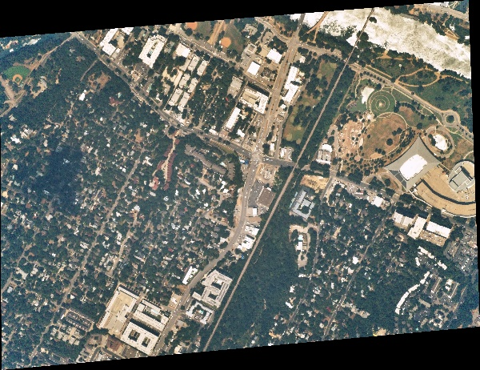

# gRPC stac-client-python

### What is this Good for
Use this library to access download information and other details for aerial imagery and for other geospatial datasets. This client accesses [Near Space Labs](https://nearspacelabs.com)' gRPC STAC service (or any gRPC STAC service). Landsat, NAIP and the Near Space Labs's Swift datasets are available for search. The best way to get familiar with the Near Space Labs client is to pip install the `nsl.stac` package and use the [Jupyter Notebooks provided](#running-included-jupyter-notebooks).

### Sections
- [Setup](#setup)
- [First Code Example](#first-code-example)
- [STAC metadata structure](#what-are-protobufs-grpc-and-spatio-temporal-asset-catalogs)
  - [Stac Item In Depth](./StacItem.md)
- [Queries](#queries)
  - [Simple](#simple-query-and-the-makeup-of-a-stacitem)
  - [Spatial](#spatial-queries)
  - [Temporal](#temporal-queries)
  - [Complex Examples](./Examples.md)
- [Downloading](#downloading)
- [gRPC STAC vs REST STAC](#differences-between-grpcprotobuf-stac-and-openapijson-stac)

### Setup
**WARNING** You'll need to have Python3 installed (nsl.stac **does not** work with Python2). If you've got multiple versions of Python and pip on your operating system, you may need to use `python3` and `pip3` in the below installation commands.

Grab `nsl.stac` from [pip](https://pypi.org/project/nsl.stac/):
```bash
pip install nsl.stac
```

Install it from source:
```bash
pip install -r requirements.txt
python setup.py install
```

#### Environment Variables
There are a few environment variables that the stac-client-python library relies on for accessing the STAC service:

- `NSL_ID` and `NSL_SECRET`, if you're downloading Near Space Labs data you'll need credentials.
- `STAC_SERVICE`, (not required) If left unset it defaults to defaults to "eap.nearspacelabs.net:9090". This is the address of the STAC metadata service.

#### Running Included Jupyter Notebooks
If you are using a virtual environment, but the jupyter you use is outside that virtual env, then you'll have to add your virtual environment to jupyter using something like `python -m ipykernel install --user --name=myenv` (more [here](https://janakiev.com/blog/jupyter-virtual-envs/)). Your best python life is no packages installed globally and always living virtual environment to virtual environment.

Install the requirements for the demo:

```bash

pip install -r requirements-demo.txt

```

On Mac or Linux you can run Jupyter notebook with your environment variables set for `NSL_ID` and `NSL_SECRET`:

```bash

NSL_ID="YOUR_ID" NSL_SECRET="YOUR_SECRET" jupyter notebook

```

If you're on windows you'll need to set your environment variables using the `SET` command or in the [system environment variables gui](https://www.hows.tech/2019/03/how-to-set-environment-variables-in-windows-10.html). Then call `jupyter notebook`.

### First Code Example
Using [StacRequest](https://geo-grpc.github.io/api/#epl.protobuf.StacRequest) to construct a spatial and temporal query to return one [StacItem](https://geo-grpc.github.io/api/#epl.protobuf.StacItem). Under the hood the `client.search_one` method uses the [StacService's](https://geo-grpc.github.io/api/#epl.protobuf.StacService) SearchOne gRPC method


<details><summary>Python Code Sample</summary>


```python
import os
import tempfile
from datetime import datetime, date
# the StacRequest is a protobuf message for making filter queries for data
from epl.protobuf.stac_pb2 import StacRequest
# GeometryData is a protobuf container for GIS geometry information
from epl.protobuf.geometry_pb2 import GeometryData, SpatialReferenceData
# TimestampField is a query field that allows for making sql-like queries for information
# GT_OR_EQ is an enum that means greater than or equal to the value in the query field
from epl.protobuf.query_pb2 import GT_OR_EQ
from nsl.stac.utils import pb_timestampfield, download_asset

# the client package stubs out a little bit of the gRPC connection code 
from nsl.stac.client import NSLClient

# our area of interest will be the coordinates of the Austin, Texas capital building
austin_capital_wkt = "POINT(-97.733333 30.266667)"
geometry_data = GeometryData(wkt=austin_capital_wkt, sr=SpatialReferenceData(wkid=4326))

# Query data from August 1, 2019
time_filter = pb_timestampfield(value=date(2019, 8, 1), rel_type=GT_OR_EQ)

# This search looks for any type of imagery hosted in the STAC service that intersects the austin capital 
# area of interest and was observed on or after the 1st of August
stac_request = StacRequest(datetime=time_filter, geometry=geometry_data)

# get a client interface to the gRPC channel. This client singleton is threadsafe
client = NSLClient()
# search_one method requests only one item be returned that meets the query filters in the StacRequest 
# the item returned is a StacItem protobuf message
stac_item = client.search_one(stac_request)
# display the scene id
print("STAC item id {}".format(stac_item.id))

# display the observed date of the scene. The observed 
dt_observed = datetime.utcfromtimestamp(stac_item.observed.seconds)
print("Date observed {}".format(dt_observed.strftime("%m/%d/%Y, %H:%M:%S")))

asset = stac_item.assets['GEOTIFF_RGB']

with tempfile.TemporaryDirectory() as d:
    file_path = download_asset(asset=asset, save_directory=d)
    print("{0} has {1} bytes".format(os.path.basename(file_path), os.path.getsize(file_path)))
```


</details>


<details><summary>Python Print-out</summary>


```text
    nsl client connecting to stac service at: eap.nearspacelabs.net:9090
    
    STAC item id 20191122T133132Z_1495_ST2_POM1
    Date observed 08/08/2019, 19:00:03
    20191122T133132Z_1495_ST2_POM1.tif has 5912460 bytes
```


</details>


### What are Protobufs, gRPC, and Spatio Temporal Asset Catalogs? 
This python client library is used for connecting to a gRPC enabled STAC service. STAC items and STAC requests are Protocol Buffers (protobuf) instead of traditional JSON.

Never hear of gRPC, Protocol Buffers or STAC? Below are summary blurbs and links for more details about this open source projects.

Definition of STAC from https://stacspec.org/:
> The SpatioTemporal Asset Catalog (STAC) specification provides a common language to describe a range of geospatial information, so it can more easily be indexed and discovered.  A 'spatiotemporal asset' is any file that represents information about the earth captured in a certain space and time.

Definition of gRPC from https://grpc.io
> gRPC is a modern open source high performance RPC framework that can run in any environment. It can efficiently connect services in and across data centers with pluggable support for load balancing, tracing, health checking and authentication. It is also applicable in last mile of distributed computing to connect devices, mobile applications and browsers to backend services.

Definitions of Protocol Buffers (protobuf) from https://developers.google.com/protocol-buffers/
> Protocol buffers are Google's language-neutral, platform-neutral, extensible mechanism for serializing structured data – think XML, but smaller, faster, and simpler. You define how you want your data to be structured once, then you can use special generated source code to easily write and read your structured data to and from a variety of data streams and using a variety of languages.

In other words:
- You can think of Protobuf as strict a data format like xml or JSON + linting, except Protobuf is a compact binary message with strongly typed fields
- gRPC is similar to REST + OpenAPI, except gRPC is an [RPC](https://en.wikipedia.org/wiki/Remote_procedure_call) framework that supports bi-directional streaming
- STAC is a specification that helps remove repeated efforts for searching geospatial datasets (like WFS for specific data types)


### Queries

#### Simple Query and the Makeup of a StacItem
There easiest query to construct is a `StacRequest` constructor with no variables, and the next simplest, is the case where we know the STAC item `id` that we want to search. If we already know the STAC `id` of an item, we can construct the `StacRequest` as follows:


<details><summary>Python Code Sample</summary>


```python
from nsl.stac.client import NSLClient
from epl.protobuf.stac_pb2 import StacRequest

stac_request = StacRequest(id='20191121T192629Z_1594_ST2_POM1')

# get a client interface to the gRPC channel
client = NSLClient()
# for this request we might as well use the search one, as STAC ids ought to be unique
stac_item = client.search_one(stac_request)
print(stac_item)
```


</details>


<details><summary>Python Print-out</summary>


```text
    id: "20191121T192629Z_1594_ST2_POM1"
    geometry {
      wkb: "\001\006\000\000\000\001\000\000\000\001\003\000\000\000\001\000\000\000\005\000\000\000\316\252\210\342\367nX\300\265K\302O\323?>@\246\336\241u\325mX\300\211\271\345\000\310?>@:\337\320\324\322mX\300\251;N.\360B>@\343@\000K\365nX\300+\205\227~\373B>@\316\252\210\342\367nX\300\265K\302O\323?>@"
      sr {
        wkid: 4326
      }
      simple: STRONG_SIMPLE
    }
    bbox {
      xmin: -97.73387969347388
      ymin: 30.24914556129946
      xmax: -97.71599312207846
      ymax: 30.261650001518472
      sr {
        wkid: 4326
      }
    }
    properties {
      type_url: "type.googleapis.com/st.protobuf.SwiftMetadata"
      value: "\n\03420190829T153004Z_HAYS_COUNTY\022 4720b2613dc9377a70e74076acb739cf\032\02620191121T192621Z_DAVID \01022\032+POINT(-97.71175384521484 30.19917869567871):\003\010\346!:\005\rf\001\242FB\003 \272\014R\03620190904T154946Z_1594_POM2_ST1Z\03620190829T172857Z_1594_POM1_ST2Z\03620190904T154533Z_1594_POM2_ST1Z\03620190904T154946Z_1594_POM2_ST1b\03620190829T172857Z_1594_POM1_ST2h\001p\001\200\001\354\010\210\001\270\252\023"
    }
    assets {
      key: "GEOTIFF_RGB"
      value {
        href: "https://eap.nearspacelabs.net/download/20191121T192621Z_DAVID/Publish_0/20191121T192629Z_1594_ST2_POM1.tif"
        type: "image/vnd.stac.geotiff"
        eo_bands: RGB
        asset_type: GEOTIFF
        cloud_platform: GCP
        bucket_manager: "Swiftera"
        bucket_region: "us-central1"
        bucket: "swiftera-processed-data"
        object_path: "20191121T192621Z_DAVID/Publish_0/20191121T192629Z_1594_ST2_POM1.tif"
      }
    }
    assets {
      key: "THUMBNAIL_RGB"
      value {
        href: "https://eap.nearspacelabs.net/download/20191121T192621Z_DAVID/Publish_0/20191121T192629Z_1594_ST2_POM1_thumb.jpg"
        type: "image/jpeg"
        eo_bands: RGB
        asset_type: THUMBNAIL
        cloud_platform: GCP
        bucket_manager: "Swiftera"
        bucket_region: "us-central1"
        bucket: "swiftera-processed-data"
        object_path: "20191121T192621Z_DAVID/Publish_0/20191121T192629Z_1594_ST2_POM1_thumb.jpg"
      }
    }
    datetime {
      seconds: 1567099737
      nanos: 259586000
    }
    observed {
      seconds: 1567099737
      nanos: 259586000
    }
    processed {
      seconds: 1574364389
      nanos: 584799000
    }
    updated {
      seconds: 1574364390
      nanos: 282194298
    }
    eo {
      platform: SWIFT_2
      instrument: POM_1
      constellation: SWIFT
      sun_azimuth {
        value: 141.74072265625
      }
      sun_elevation {
        value: 64.46234130859375
      }
      off_nadir {
        value: 19.908658981323242
      }
      azimuth {
        value: 102.08956146240234
      }
    }
    
```


</details>


The above print out for the stac item is quite lengthy. Although `stac_item` is a protobuf object, it's `__str__` method prints out a JSON-like object. You can see in the below example that this `StacItem` contains the following:
- [GeometryData](https://geo-grpc.github.io/api/#epl.protobuf.GeometryData) which is defined with a WGS-84 well-known binary geometry
- [EnvelopeData](https://geo-grpc.github.io/api/#epl.protobuf.EnvelopeData) which is also WGS-84
- [Timestamp](https://github.com/protocolbuffers/protobuf/blob/master/src/google/protobuf/timestamp.proto) Google's protobuf unix time format
- [Eo](https://geo-grpc.github.io/api/#epl.protobuf.Eo) for electro-optical sensor details
- [Landsat](https://geo-grpc.github.io/api/#epl.protobuf.Landsat) for Landsat sepcific details
- an array map of [StacItem.AssetsEntry](https://geo-grpc.github.io/api/#epl.protobuf.StacItem.AssetsEntry) with each [Asset](https://geo-grpc.github.io/api/#epl.protobuf.Asset) containing details about [AssetType](https://geo-grpc.github.io/api/#epl.protobuf.AssetType), Electro Optical [Band enums](https://geo-grpc.github.io/api/#epl.protobuf.Eo.Band) (if applicable), and other details for downloading and interpreting data

You may have notice that the [Asset](https://geo-grpc.github.io/api/#epl.protobuf.Asset) in the above python print out has a number of additional parameters not included in the JSON STAC specification. 

#### Spatial Queries
The STAC specification has a bounding box `bbox` specification for STAC items. Here we make a STAC request using a bounding box. One slight difference from JSON STAC, is that we define an [EnvelopeData](https://geo-grpc.github.io/api/#epl.protobuf.EnvelopeData) protobuf object. This allows us to use other projections besides WGS84


<details><summary>Python Code Sample</summary>


```python
from epl.protobuf.stac_pb2 import StacRequest
from epl.protobuf.geometry_pb2 import EnvelopeData, SpatialReferenceData
from nsl.stac.client import NSLClient

# define our area of interest bounds
neighborhood_box = (-97.73294577459876, 30.251945643016235, -97.71732458929603, 30.264548996109724)
# here we define our envelope_data protobuf with bounds and a WGS-84 (`wkid=4326`) spatial reference
envelope_data = EnvelopeData(xmin=neighborhood_box[0], 
                             ymin=neighborhood_box[1], 
                             xmax=neighborhood_box[2], 
                             ymax=neighborhood_box[3],
                             sr=SpatialReferenceData(wkid=4326))
# Search for data that intersects the bounding box
stac_request = StacRequest(bbox=envelope_data)

# get a client interface to the gRPC channel
client = NSLClient()
for stac_item in client.search(stac_request):
    print("STAC item id: {}".format(stac_item.id))
```


</details>


<details><summary>Python Print-out</summary>


```text
    STAC item id: 20191121T192629Z_1594_ST2_POM1
    STAC item id: 20191110T005417Z_1594_ST2_POM1
    STAC item id: 20191121T174541Z_1594_ST2_POM1
    STAC item id: 20191110T003517Z_1594_ST2_POM1
    STAC item id: 20191121T182921Z_1594_ST2_POM1
    STAC item id: 20191111T193822Z_1594_ST2_POM1
    STAC item id: 20191121T201211Z_1594_ST2_POM1
    STAC item id: 20191110T002000Z_1594_ST2_POM1
    STAC item id: 20191110T004641Z_1594_ST2_POM1
    STAC item id: 20191122T130151Z_1594_ST2_POM1
```


</details>


Above should be printed the STAC ids of 10 items (10 is the default limit for the service we connected to).

Next we want to try searching by geometry instead of bounding box. We'll use a geojson to define our [GeometryData](https://geo-grpc.github.io/api/#epl.protobuf.GeometryData) protobuf. GeometryData can be defined using geojson, wkt, wkb, or esrishape:


<details><summary>Python Code Sample</summary>


```python
import json
import requests
from nsl.stac.client import NSLClient
from epl.protobuf.stac_pb2 import StacRequest
from epl.protobuf.geometry_pb2 import GeometryData, SpatialReferenceData

# request the geojson foot print of Travis County, Texas
r = requests.get("https://raw.githubusercontent.com/johan/world.geo.json/master/countries/USA/TX/Travis.geo.json")
travis_geojson = json.dumps(r.json()['features'][0]['geometry'])
# create our GeometryData protobuf from geojson string and WGS-84 SpatialReferenceData protobuf
geometry_data = GeometryData(geojson=travis_geojson, 
                             sr=SpatialReferenceData(wkid=4326))
# Search for data that intersects the geojson geometry and limit results to 2 (instead of default of 10)
stac_request = StacRequest(geometry=geometry_data, limit=2)
# collect the ids from STAC items to compare against results from wkt GeometryData
geojson_ids = []

# get a client interface to the gRPC channel
client = NSLClient()
for stac_item in client.search(stac_request):
    print("STAC item id: {}".format(stac_item.id))
    geojson_ids.append(stac_item.id)
```


</details>


<details><summary>Python Print-out</summary>


```text
    STAC item id: 20191110T003517Z_1594_ST2_POM1
    STAC item id: 20191110T002000Z_1594_ST2_POM1
```


</details>


Same geometry as above, but a wkt geometry instead of a geojson:


<details><summary>Python Code Sample</summary>


```python
# Same geometry as above, but a wkt geometry instead of a geojson
travis_wkt = "POLYGON((-97.9736 30.6251, -97.9188 30.6032, -97.9243 30.5703, -97.8695 30.5484, -97.8476 30.4717, -97.7764 30.4279, -97.5793 30.4991, -97.3711 30.4170, -97.4916 30.2089, -97.6505 30.0719, -97.6669 30.0665, -97.7107 30.0226, -98.1708 30.3567, -98.1270 30.4279, -98.0503 30.6251))" 
geometry_data = GeometryData(wkt=travis_wkt, 
                             sr=SpatialReferenceData(wkid=4326))
stac_request = StacRequest(geometry=geometry_data, limit=2)
for stac_item in client.search(stac_request):
    print("STAC item id: {0} from wkt filter intersects result from geojson filter: {1}"
          .format(stac_item.id, stac_item.id in geojson_ids))
```


</details>


<details><summary>Python Print-out</summary>


```text
    STAC item id: 20191110T003517Z_1594_ST2_POM1 from wkt filter intersects result from geojson filter: True
    STAC item id: 20191110T002000Z_1594_ST2_POM1 from wkt filter intersects result from geojson filter: True
```


</details>


#### Temporal Queries
When it comes to Temporal queries there are a few things to note. One is that we are using Google's [Timestamp proto](https://github.com/protocolbuffers/protobuf/blob/master/src/google/protobuf/timestamp.proto) to define the temporal aspect of STAC items. This means time is stored with a `int64` for seconds and a `int32` for nanoseconds relative to an epoch at UTC midnight on January 1, 1970.

So when you read the time fields on a [StacItem](https://geo-grpc.github.io/api/#epl.protobuf.StacItem), you'll notice that `datetime`, `observed`, `updated`, and `processed` all use the Timestamp Protobuf object.

When creating a time query filter, we want to use the >, >=, <, <=, ==, != operations and inclusive and exclusive range requests. We do this by using a [TimestampField](https://geo-grpc.github.io/api/#epl.protobuf.TimestampField), where we define the value using the `value` field or the `start`&`stop` fields. And then we define a relationship type using the `rel_type` field and the [FieldRelationship](https://geo-grpc.github.io/api/#epl.protobuf.FieldRelationship) enum values of `EQ`, `LT_OR_EQ`, `GT_OR_EQ`, `LT`, `GT`, `BETWEEN`, `NOT_BETWEEN`, or `NOT_EQ`.


<details><summary>Python Code Sample</summary>


```python
from datetime import date, datetime, timezone
from nsl.stac.client import NSLClient
from nsl.stac import utils
from epl.protobuf.stac_pb2 import StacRequest
from epl.protobuf.query_pb2 import GT_OR_EQ

# make a filter that selects all data on or after January 1st, 2017
time_filter = utils.pb_timestampfield(value=date(2017,1,1), rel_type=GT_OR_EQ)
stac_request = StacRequest(datetime=time_filter, limit=2)

# get a client interface to the gRPC channel
client = NSLClient()
for stac_item in client.search(stac_request):
    print("STAC item date, {0}, is after {1}: {2}".format(
        datetime.fromtimestamp(stac_item.observed.seconds, tz=timezone.utc).isoformat(),
        datetime.fromtimestamp(time_filter.start.seconds, tz=timezone.utc).isoformat(),
        stac_item.observed.seconds > time_filter.start.seconds))
```


</details>


<details><summary>Python Print-out</summary>


```text
    STAC item date, 2019-08-29T17:28:57+00:00, is after 1970-01-01T00:00:00+00:00: True
    STAC item date, 2019-08-29T17:28:57+00:00, is after 1970-01-01T00:00:00+00:00: True
```


</details>


The above result shows the datetime of the STAC item, the datetime of the query and a confirmation that they satisfy the query filter. Notice the warning, this is because our date doesn't have a timezone associated with it. By default we assume UTC.

Now we're going to do a range request and select data between two dates:


<details><summary>Python Code Sample</summary>


```python
from datetime import datetime, timezone
from nsl.stac.client import NSLClient
from nsl.stac import utils
from epl.protobuf.stac_pb2 import StacRequest
from epl.protobuf.query_pb2 import TimestampField, BETWEEN
# Query data from August 1, 2019
start = datetime(2019, 8, 1, 0, 0, 0, tzinfo=timezone.utc)
# ... up until August 10, 2019
stop = datetime(2019, 8, 10, 0, 0, 0, tzinfo=timezone.utc)
time_filter = utils.pb_timestampfield(start=start, end=stop, rel_type=BETWEEN)

stac_request = StacRequest(datetime=time_filter, limit=2)

# get a client interface to the gRPC channel
client = NSLClient()
for stac_item in client.search(stac_request):
    print("STAC item date, {0}, is before {1}: {2}".format(
        datetime.fromtimestamp(stac_item.observed.seconds, tz=timezone.utc).isoformat(),
        datetime.fromtimestamp(time_filter.stop.seconds, tz=timezone.utc).isoformat(),
        stac_item.observed.seconds < time_filter.stop.seconds))
```


</details>


<details><summary>Python Print-out</summary>


```text
    STAC item date, 2019-08-08T19:23:02+00:00, is before 2019-08-10T00:00:00+00:00: True
    STAC item date, 2019-08-08T19:23:02+00:00, is before 2019-08-10T00:00:00+00:00: True
```


</details>


In the above print out we are returned STAC items that are between the dates of Jan 1 2017 and Jan 1 2018. Also, notice there's no warnings as we defined our utc timezone on the datetime objects.

### Downloading
To download an asset use the `bucket` + `object_path` or the `href` fields from the asset, and download the data using the library of your choice. There is also a download utility in the `nsl.stac.utils` module. Downloading from Google Cloud Storage buckets requires having defined your `GOOGLE_APPLICATION_CREDENTIALS` [environment variable](https://cloud.google.com/docs/authentication/getting-started#setting_the_environment_variable). Downloading from AWS/S3 requires having your configuration file or environment variables defined as you would for [boto3](https://boto3.amazonaws.com/v1/documentation/api/1.9.42/guide/quickstart.html#configuration). To downlad an asset follow the pattern in the below example:


<details><summary>Python Code Sample</summary>


```python
import tempfile
from IPython.display import Image, display

from nsl.stac.client import NSLClient
from nsl.stac import utils
from epl.protobuf.stac_pb2 import StacRequest

stac_request = StacRequest(id='20191121T192629Z_1594_ST2_POM1')

# get a client interface to the gRPC channel
client = NSLClient()
# for this request we might as well use the search one, as STAC ids ought to be unique
stac_item = client.search_one(stac_request)

asset = stac_item.assets['THUMBNAIL_RGB']
with tempfile.NamedTemporaryFile(suffix=".jpg") as file_obj:
    utils.download_asset(asset=asset, save_filename=file_obj.name)
    display(Image(filename=file_obj.name))
```


</details>





## Differences between gRPC+Protobuf STAC and OpenAPI+JSON STAC
If you are already familiar with STAC, you'll need to know that gRPC + Protobuf STAC is slightly different from the JSON definitions. 

JSON is naturally a flexible format and with linters you can force it to adhere to rules. Protobuf is a strict data format and that required a few differences between the JSON STAC specification and the protobuf specification:

### JSON STAC Compared with Protobuf STAC

#### STAC Item Comparison
For Comparison, here is the [JSON STAC item field summary](https://github.com/radiantearth/stac-spec/blob/master/item-spec/item-spec.md#item-fields) and the [Protobuf STAC item field summary](https://geo-grpc.github.io/api/#epl.protobuf.StacItem). Below is a table comparing the two:


|  Field Name 	| STAC Protobuf Type                                                                                                       	| STAC JSON Type                                                             	|
|-------------	|--------------------------------------------------------------------------------------------------------------------------	|----------------------------------------------------------------------------	|
| id          	| [string](https://geo-grpc.github.io/api/#string)                                                                         	| string                                                                     	|
| type        	| NA                                                                                                                       	| string                                                                     	|
| geometry    	| [GeometryData](https://geo-grpc.github.io/api/#epl.protobuf.GeometryData)                                                	| [GeoJSON Geometry Object](https://tools.ietf.org/html/rfc7946#section-3.1) 	|
| bbox        	| [EnvelopeData](https://geo-grpc.github.io/api/#epl.protobuf.EnvelopeData)                                                	| [number]                                                                   	|
| properties  	| [google.protobuf.Any](https://developers.google.com/protocol-buffers/docs/proto3#any)                                               	| Properties Object                                                          	|
| links       	| NA                                                                                                                       	| [Link Object]                                                              	|
| assets      	| [StacItem.AssetsEntry](https://geo-grpc.github.io/api/#epl.protobuf.StacItem.AssetsEntry)                                	| Map                                                                        	|
| collection  	| [string](https://geo-grpc.github.io/api/#string)                                                                         	| string                                                                     	|
| title       	| [string](https://geo-grpc.github.io/api/#string)                                                                         	| Inside Properties                                                          	|
| datetime    	| [google.protobuf.Timestamp](https://github.com/protocolbuffers/protobuf/blob/master/src/google/protobuf/timestamp.proto) 	| Inside Properties                                                          	|
| observation 	| [google.protobuf.Timestamp](https://github.com/protocolbuffers/protobuf/blob/master/src/google/protobuf/timestamp.proto) 	| Inside Properties                                                          	|
| processed   	| [google.protobuf.Timestamp](https://github.com/protocolbuffers/protobuf/blob/master/src/google/protobuf/timestamp.proto) 	| Inside Properties                                                          	|
| updated     	| [google.protobuf.Timestamp](https://github.com/protocolbuffers/protobuf/blob/master/src/google/protobuf/timestamp.proto) 	| Inside Properties                                                          	|
| duration    	| [google.protobuf.Duration](https://github.com/protocolbuffers/protobuf/blob/master/src/google/protobuf/duration.proto)   	| Inside Properties                                                          	|
| eo          	| [Eo](https://geo-grpc.github.io/api/#epl.protobuf.Eo)                                                                    	| Inside Properties                                                          	|
| sar         	| [Sar](https://geo-grpc.github.io/api/#epl.protobuf.Sar)                                                                  	| Inside Properties                                                          	|
| landsat     	| [Landsat](https://geo-grpc.github.io/api/#epl.protobuf.Landsat)                                                          	| Inside Properties                                                          	|


#### Eo Comparison
For Comparison, here is the [JSON STAC Electro Optical field summary](https://github.com/radiantearth/stac-spec/tree/master/extensions/eo#item-fields) and the [Protobuf STAC Electro Optical field summary](https://geo-grpc.github.io/api/#epl.protobuf.Eo). Below is a table comparing the two:

| JSON Field Name  	| JSON Data Type 	| Protobuf Field Name 	| Protobuf Data Type                  	|
|------------------	|----------------	|---------------------	|-------------------------------------	|
| eo:gsd           	| number         	| gsd                 	| [google.protobuf.wrappers.FloatValue](https://github.com/protocolbuffers/protobuf/blob/master/src/google/protobuf/wrappers.proto) 	|
| eo:platform      	| string         	| platform            	| [Eo.Platform](https://geo-grpc.github.io/api/#epl.protobuf.Eo.Platform)                         	|
| eo:instrument    	| string         	| instrument          	| [Eo.Instrument](https://geo-grpc.github.io/api/#epl.protobuf.Eo.Instrument)                       	|
| eo:constellation 	| string         	| constellation       	| [Eo.Constellation](https://geo-grpc.github.io/api/#epl.protobuf.Eo.Platform)                    	|
| eo:bands         	| [Band Object](https://github.com/radiantearth/stac-spec/tree/master/extensions/eo#band-object)  	| bands               	| [Eo.Band](https://geo-grpc.github.io/api/#epl.protobuf.Eo.Band)                             	|
| eo:epsg          	| integer        	| epsg                	| uint32                              	|
| eo:cloud_cover   	| number         	| cloud_cover         	| [google.protobuf.wrappers.FloatValue](https://github.com/protocolbuffers/protobuf/blob/master/src/google/protobuf/wrappers.proto) 	|
| eo:off_nadir     	| number         	| off_nadir           	| [google.protobuf.wrappers.FloatValue](https://github.com/protocolbuffers/protobuf/blob/master/src/google/protobuf/wrappers.proto) 	|
| eo:azimuth       	| number         	| azimuth             	| [google.protobuf.wrappers.FloatValue](https://github.com/protocolbuffers/protobuf/blob/master/src/google/protobuf/wrappers.proto) 	|
| eo:sun_azimuth   	| number         	| sun_azimuth         	| [google.protobuf.wrappers.FloatValue](https://github.com/protocolbuffers/protobuf/blob/master/src/google/protobuf/wrappers.proto) 	|
| eo:sun_elevation 	| number         	| sun_elevation       	| [google.protobuf.wrappers.FloatValue](https://github.com/protocolbuffers/protobuf/blob/master/src/google/protobuf/wrappers.proto) 	|


### Updating the samples in this README
Use this Jupyter Notebook to update the README.md. Do not directly edit the README.md. It will be overwritten by output from `ipynb2md.py`. First edit this README.ipynb, in kernel Restart & Run All to confirm your changes worked, Save and Checkpoint, then run the python script `python ipynb2md.py -i README.ipynb`.

